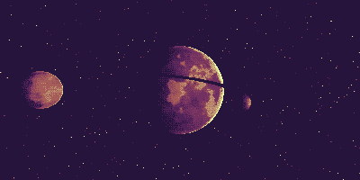

# Space Sceneries



A from-scratch C++ raytracer with a **Blender-style scene editor** for composing
simplified, pixel-art space scenes and exporting them as PNGs. You arrange bodies in
a live viewport, light them with emissive suns, and a palette post-process crushes
the final image toward deliberate pixel-art color.

## What you can make

- **Planets and moons** — spheres with procedural 3D textures (fbm noise, warped
  latitude bands for gas giants), translucent **cloud** layers, and Fresnel-limb
  **atmospheres**.
- **Rings** — translucent annular disks with radial color ramps, lit from either face.
- **Suns** — emissive bodies that act as the scene's lights (with hard shadows and
  optional inverse-square falloff).
- **Starfields** — seeded backgrounds with denser and sparser (nebula) regions, an
  optional Milky-Way-style **galactic band**, and animated **shooting stars**.
- **Motion** — **Kepler elliptic orbits** (and circles) plus spin, scrubbable on a
  timeline so scenes animate.
- **Random star systems** — a **Generate** tab builds a whole system (sun, planets,
  moons, rings) with real-system-inspired spacing, then orbits the camera around a
  planet; tweak the seed, planet/moon counts, spacing, and tilt.
- **A pixel-art look** — generated HSV palettes (harmonic schemes — monochromatic,
  complementary, triadic, analogous, or hand-anchored — saveable to a reusable library)
  with dithering, applied identically to the viewport and the exported PNG.
- **An infinite eclipse loop** — an "Infinite mode" that opens on a planet eclipsing
  its sun, reveals the system as it plays, then silently regenerates a whole new system
  at each eclipse (with a morphing palette), so the scene renews itself forever.

## Build & run

GLFW and OpenGL come from the system; `nlohmann/json`, Dear ImGui, and
`stb_image_write` are vendored in `third_party/`.

```bash
cmake -S . -B build        # first time / after CMakeLists or file-list changes
cmake --build build -j     # after editing code
./build/space_sceneries          # the editor (needs a display)
./build/space_sceneries_tests    # headless sanity checks
```

Saved scenes go in `scenes/`, saved palettes in `palettes/`, and exported PNGs in
`renders/` (all created on first run).
